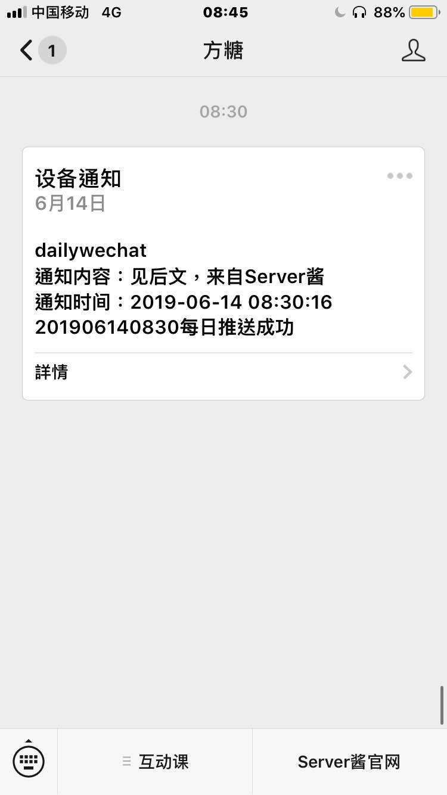
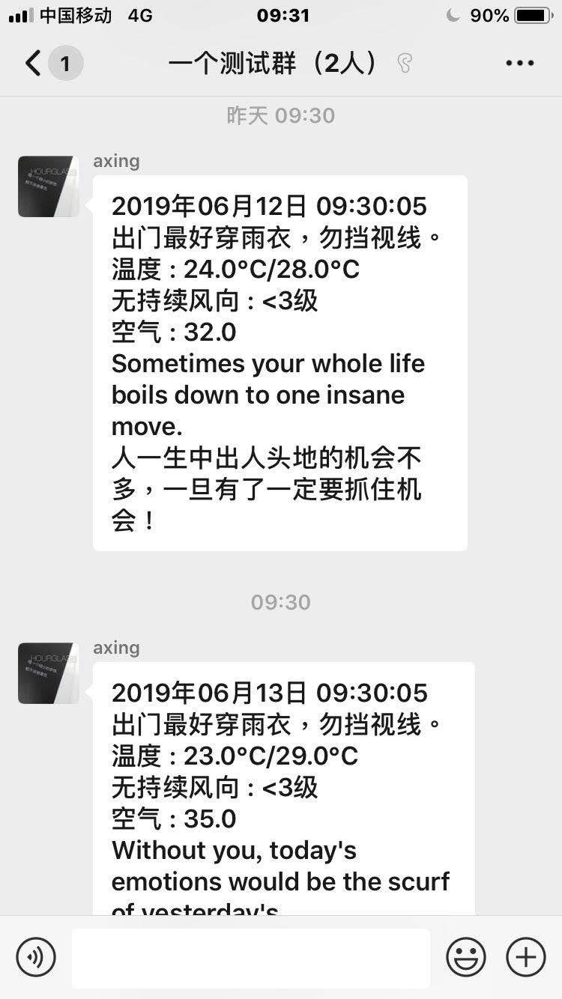

## 0x00 Introduction

每日微信推送，并通过 [server chan](http://sc.ftqq.com/3.version) 获取通知。

## 0x01 Development

项目根目录创建 .env 文件

`SCKEY=XXXXX` (替换 XXX 为 server 酱上的 key)

修改 _config.yaml 文件，其中 type 指定类型 'group' 或 'person'

```sh
pipenv install
pipenv run python run.py
```

其他配置可以参考 EverydayWechat，现在这个项目感觉比较冗余，加入了图灵机器人一些我认为没啥必要的东西，所以迁出实现了自己需要的功能。





## 0x02 Acknowledgement

- https://github.com/sfyc23/EverydayWechat