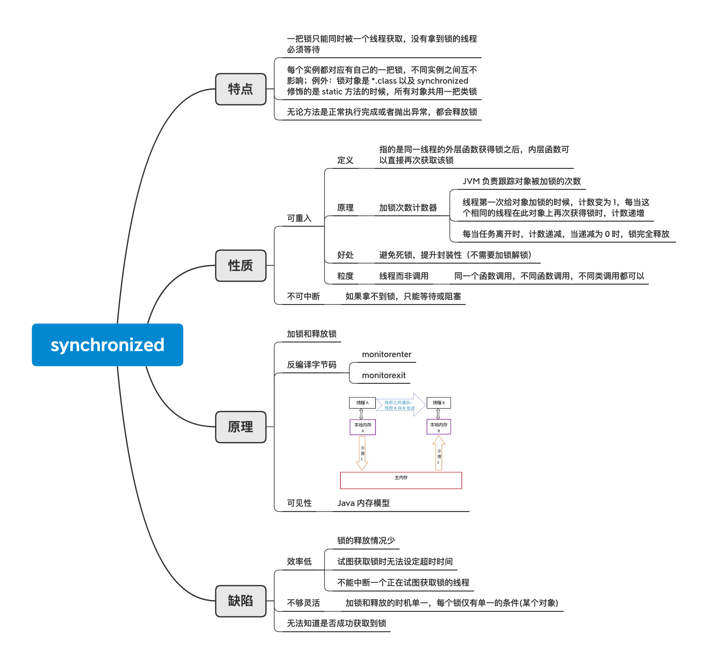

# synchronized notes

- 一把锁只能同时被一个线程获取，没有拿到锁的线程必须等待

- 每个实例都对应有自己的一把锁，不同实例之间互不影响；例外：锁对象是 `*.class` 以及 `synchronized` 修饰的是 static 方法的时候，所有对象共用一把类锁

- 无论方法是正常执行完成或者抛出异常，都会释放锁

## 性质

- 可重入：指的是同一线程的外层函数获得锁之后，内层函数可以直接再次获取该锁

好处：避免死锁，提升封装性（不需要加锁解锁）

粒度：线程而非调用

同一个函数调用，不同函数调用，不同类调用，均没有问题

- 不可中断：

如果拿不到锁，只能等待或阻塞

## 原理

加锁和释放锁、monitorenter、monitorexit

```
javac Decompilation14.java
javap -verbose Decompilation14
```

```
 public void insert(java.lang.Thread);
    descriptor: (Ljava/lang/Thread;)V
    flags: ACC_PUBLIC
    Code:
      stack=2, locals=4, args_size=2
         0: aload_0
         1: getfield      #3                  // Field object:Ljava/lang/Object;
         4: dup
         5: astore_2
         6: monitorenter
         7: aload_2
         8: monitorexit
         9: goto          17
        12: astore_3
        13: aload_2
        14: monitorexit
        15: aload_3
        16: athrow
        17: return

```

- 可重入原理：加锁次数计数器

- 可见性原理：java 内存模型



## 致谢

[Java高并发之魂：synchronized深度解析](https://www.imooc.com/learn/1086)
