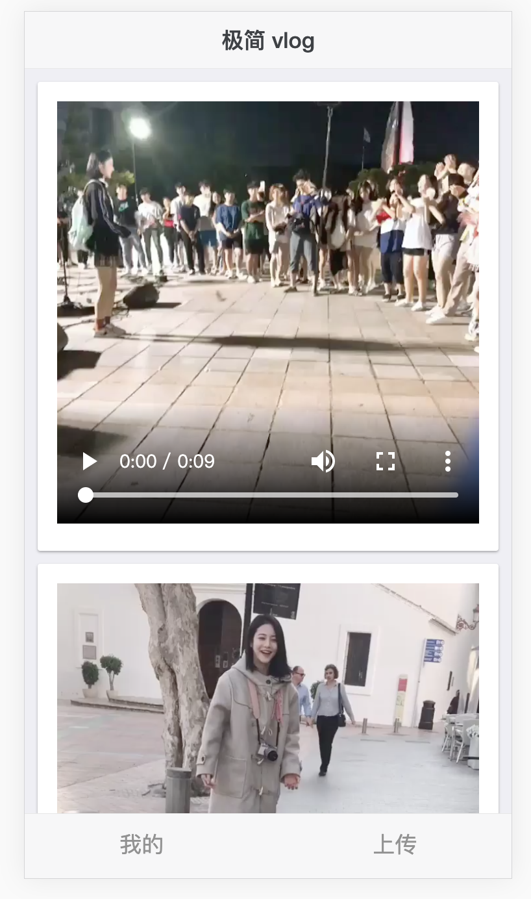

# vlogDEMO

- 使用 golang 开发前后端分离极简 vlog 

## interface 接口设计

- vlog 播放接口

接口描述：获取一条 vlog 视频
请求方法：get
请求地址：http://{server}/video/{video.mp4}
状态码：success 200

- vlog 上传接口

接口描述：上传一条 vlog 视频
请求方法：post
请求地址：http://{server}/api/upload
请求参数：
    - 参数名：uploadFile
    - 类型：file

- vlog 我的列表接口

接口描述：查看 vlog 列表
请求方法：get
请求地址：http://{server}/api/list
响应内容：{
    "http://{server}/video1.mp4",
    "http://{server}/video2.mp4"
}

## 难点

- 过大文件上传
- 视频文件校验
- 文件存储

## 效果

## qa

- `defer` 的使用

https://studygolang.com/articles/10167

- 跨域访问限制问题

前端 127.0.0.1:8887 访问 127.0.0.1:9090 端口出现跨域限制

`w.Header().Set("Access-Control-Allow-Origin", "*")`